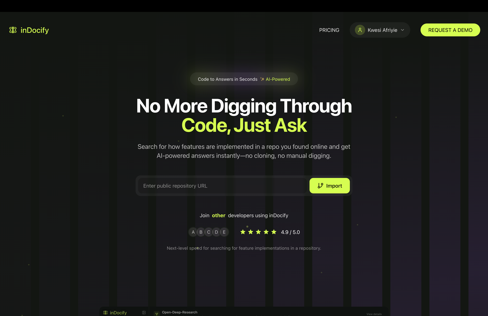

# InDocify

<div align="center">
  
</div>

InDocify helps developers instantly understand how features are implemented in any online repository using AI—no cloning, no manual digging.

<div align="center">
  <h3>📺 Watch the Demo</h3>
  <a href="apps/web/public/demo.mp4">
    
  </a>
</div>

## 🚀 What is InDocify?
InDocify is an AI-powered tool that enables developers to explore and understand the implementation details of any public code repository instantly. Using advanced AI, InDocify analyzes repositories and provides clear, actionable explanations of how features work—saving you hours of manual code reading and onboarding time.

## 💡 Why is this project useful?
- **Instant Understanding:** No need to clone or manually dig through codebases. Get instant, AI-generated explanations of features and logic.
- **Onboarding:** New team members or open source contributors can get up to speed quickly.
- **Code Review & Learning:** Great for code review, technical due diligence, or learning from real-world projects.
- **No Setup Required:** Works directly with online repositories—just provide a link!

## 🛠️ Key Features
- Analyze any public repository with AI
- Instantly explain how features are implemented
- No local setup or cloning required
- Secure: No sensitive data is stored or shared

## 🛠️ Tech Stack
- Next.js
- TypeScript
- Tailwind CSS
- pnpm
- polar.sh
- motion
- ai-sdk
- supabase
- next-auth
- tanstack-query
- turborepo

## 📦 Getting Started
### Prerequisites
- Node.js (v18 or newer recommended)
- pnpm

### Installation
1. **Clone the repository:**
   ```bash
   git clone https://github.com/Kwesi-dev/InDocify.git
   cd InDocify
   ```
2. **Install dependencies:**
   ```bash
   pnpm install
   ```
3. **Set up environment variables:**
   - Copy `.env.example` to `.env.local` and fill in the required keys (see documentation for details).

4. **Run the development server:**
   ```bash
   pnpm dev
   ```
   The app should now be running at `http://localhost:3000`.ß

## 🗄️ Database Setup
This project uses Supabase (PostgreSQL) for data storage.

### Required Tables
You will need to create the following tables in your Supabase project. You can use the Supabase dashboard or run the SQL below:

- Adjust columns as needed for your use case.
- Reference `.env.example` for required environment variables.
- For additional tables or migrations, see [docs/database.md](docs/database.md) (if available) or set them up manually in the Supabase dashboard.

### Usage
- Visit the web UI and enter the URL of a public repository to analyze its features.

## 🤝 Contributing
We welcome contributions! Please see the [CONTRIBUTING.md](CONTRIBUTING.md) file for guidelines on how to get involved, submit issues, or propose improvements.

If you do not wish to accept contributions, please state so here.

## 📄 License
This project is licensed under the MIT License. See the [LICENSE](LICENSE) file for details.

## 🙋‍♂️ Support & Contact
- For help, open an issue on GitHub.
- For feature requests or questions, start a discussion or contact the maintainers at [afriyiesamuel36@gmail.com](mailto:afriyiesamuel36@gmail.com).

---

> _README generated for open source release. Please update contact info, contribution policy, and environment details as needed._